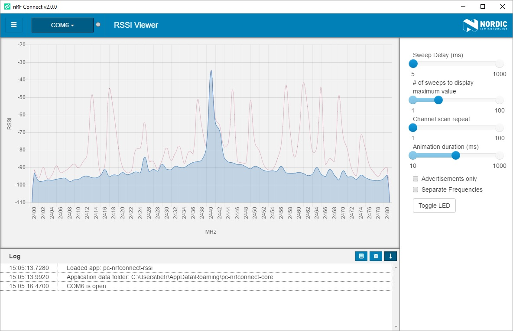

# nRF Connect RSSI Viewer

Simple app for [nRF Connect](https://github.com/NordicSemiconductor/pc-nrfconnect-core) that shows a visualization of RSSI data. The app shows dBm per frequency in the 2400-2480 MHz range, and allows the user to tweak settings like sweep delay and animation duration. The app can be installed from the *Add/remove apps* screen in nRF Connect.

The following devices are supported:

* PCA10040 nRF52832 Development Kit
* PCA10059 nRF52840 Dongle

## Background

While the RSSI Viewer is a useful tool in itself, the main purpose behind it is to demonstrate how to implement apps for nRF Connect. In addition to the RSSI Viewer, app developers can check out the [boilerplate app](https://github.com/NordicSemiconductor/pc-nrfconnect-boilerplate) and documentation for [creating apps](https://github.com/NordicSemiconductor/pc-nrfconnect-core#creating-apps).

## Implementation

### Firmware

The app comes with firmwares for the supported devices that sends RSSI data over serial port. The source code for these firmwares can be found in [fw/src](fw/src), and are included as hex files in [fw/](fw/). When selecting a device, the app will program the chip with a corresponding hex file (unless the firmware has not already been programmed).

The serial port communication from the app to the firmware is simply a few ASCII commands for starting, stopping, and adjusting settings. From the firmware to the app there is a binary flow of 3 bytes: `[0xff, channel_number, rssi]`.

### UI components and actions

The RSSI data is visualized in the MainView by a [Chart component](components/Chart.jsx) that is based on [chart.js](http://www.chartjs.org/). In the SidePanel there is a [ControlPanel component](components/ControlPanel.jsx) that allows the user to tweak some settings. Serial port communication and programming is done by the [actions](actions). The components and actions are tied together by [index.jsx](index.jsx).

## Building from source

### Dependencies

To build the app you will need to install the following tools:

* Node.js (>=6.9)
* npm (>=5.6.0) / yarn (>=1.4.0)

### Clone the repository

Open a terminal, go to the following directory, and clone the repository:

- Linux/macOS: `cd $HOME/.nrfconnect-apps/local`
- Windows: `cd %USERPROFILE%/.nrfconnect-apps/local`

Alternatively, clone the repository in a different directory and symlink it into `.nrfconnect-apps/local`.

### Building

After cloning the repository, install the required dependencies:

    npm install

Then build the app:

    npm run dev

If everything was successful, you should now be able to launch the app in nRF Connect.
