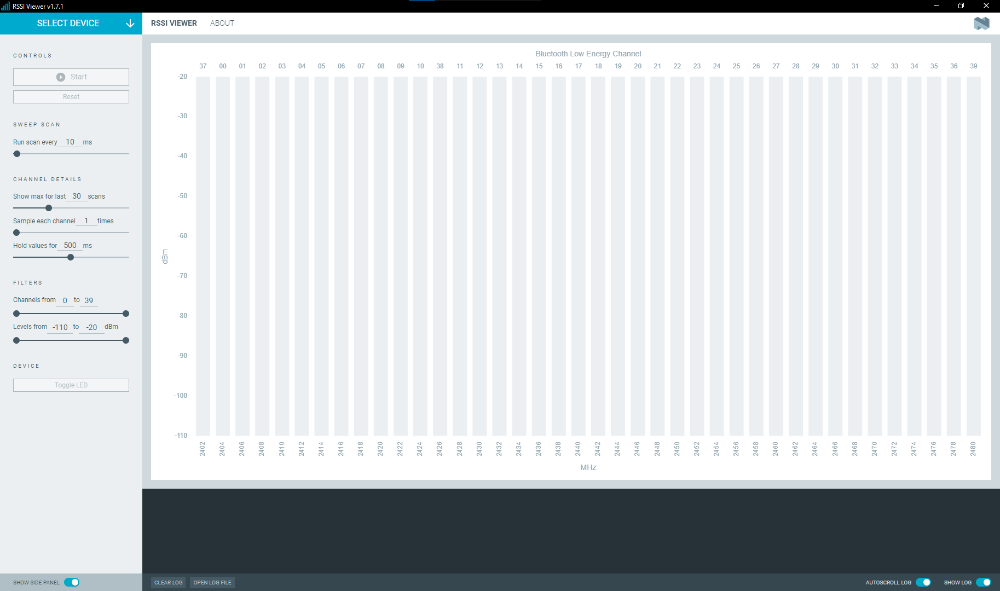

# Overview and user interface

After starting the {{app_name}}, the main application window is displayed.

The available options and information change after you **Select Device**.

## Before selection

Before a device is selected, the side panel contains the following buttons:

### Select Device

Dropdown to list the devices attached to the computer. When you select a [supported device](index.md#supported-devices), the app programs the device with the sniffer firmware, and then connects to one of the available serial ports. Sniffing starts automatically.

## After selection

When a device is selected, sniffing in the 2.4 GHz range starts automatically and the side panel options become available.

### Controls

This side panel area contains buttons that control the sniffing process:

- **Start** and **Pause** - Lets you start or pause the sniffing process.
- **Reset** - Lets you reset the sniffing output.

### Sweep Scan

This option lets you control the frequency with which the sniffing scan are run and with which the results are updated in the [**RSSI Viewer**](#rssi-viewer-tab) tab.

### Channel Details

The options in this area refer to the Bluetooth Low Energy channels displayed in the [**RSSI Viewer**](#rssi-viewer-tab) tab.

- **Show max for last X scans** - The application will hold the maximum detected value of the last X scans for the given channel.

    !!! info "Tip"
          If you configure the scan to be run every `10` ms in the [**Sweep Scan**](#sweep-scan) area and set the `X` in **Show max for last X scans** to `30`, the numerical value for each channel in the [**RSSI Viewer**](#rssi-viewer-tab) tab will show the maximum value in the last 300 ms of sniffing.

- **Sample each channel X times** - The application will sample each channel X times during each scan and will provide the average value as the maximum value.
- **Hold values for X ms** - The application will hold the values measured for the given channel for X ms. The higher the value, the more values are held. This affects the dark blue part of the channel sniffing animation in the [**RSSI Viewer**](#rssi-viewer-tab) tab.

### Filters

The options in this area allows you to filter out specific Bluetooth LE channels and dBm values in the [**RSSI Viewer**](#rssi-viewer-tab) tab.
Once you select the values, the sniffing will be performed only within your custom range.

### Device

The **Toggle LED** button lets you toggle the LED on the connected device. This feature is only available for the nRF52 DK and the nRF52840 Dongle.

## RSSI Viewer tab

This is the main area of the application where the sniffing results are displayed. Changing the side panel option settings is automatically reflected on the sniffing results when the sniffing is ongoing.

You can read the channel color coding the following way:

| Color                                | Meaning                                                                           |
| ------------------------------------ | --------------------------------------------------------------------------------- |
| Green column                         | Bluetooth LE advertisement channels (37, 38, 39).                                 |
| Blue column                          | Bluetooth LE non-advertisement channels.                                          |
| Dark hue (green or blue)             | Average value for the given channel. Depends on the value selected in **Hold values for X ms** in [**Channel Details**](#channel-details).                                             |
| Light hue (green or blue)            | Maximum value for the given channel.                                              |
| Numerical value                      | The maximum value for the given channel for the time selected in the [**Sweep Scan**](#sweep-scan) area and the amount of scans selected in **Show max for last X scans** in [**Channel Details**](#channel-details). |

## Log

The Log panel allows you to view the most important log events, tagged with a timestamp. Each time you open the app, a new session log file is created. You can find the Log panel and its controls, below the main application Window.

- When troubleshooting, to view more detailed information than shown in the Log panel, use **Open log file** to open the current log file in a text editor.
- To clear the information currently displayed in the Log panel, use **Clear Log**. The contents of the log file are not affected.
- To hide or display the Log panel in the user interface, use **Show Log**.
- To freeze Log panel scrolling, use **Autoscroll Log**.

## About tab

You can view application information, restore defaults, access source code and documentation. You also can find information on the selected device, access support tools, send feedback, and enable verbose logging.